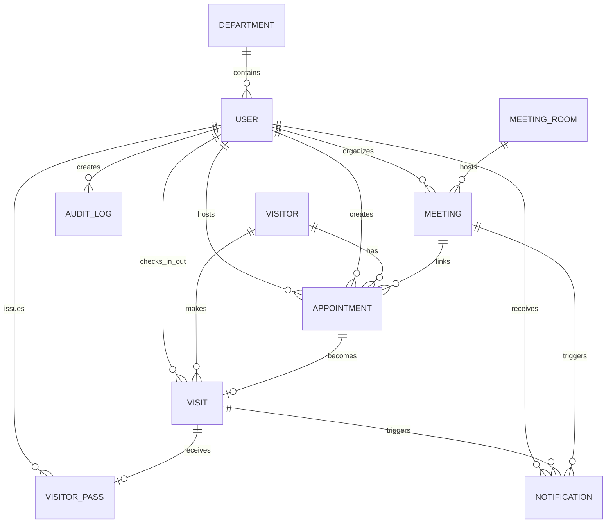

# Office Visitor & Meeting Management System

## Backend Project README

> **Backend only:** This project specification covers the server-side
> application, database, authentication, authorization, business logic,
> APIs, validation, security, notifications, reporting, and testing.
> Frontend/UI/UX implementation is intentionally excluded.

---

## 1. Project Overview

The **Office Visitor & Meeting Management System** is a centralized
web-based system for managing office visitors, employee meetings,
meeting rooms, visitor check-in/check-out, employee notifications,
visitor history, and administrative reports.

The system supports both **scheduled appointments** and **walk-in
visitors**.

### Core workflow

```text
Visitor / Employee
        |
        v
Appointment or Walk-in Registration
        |
        v
Reception Verification
        |
        v
Check-in
        |
        v
Employee Notification
        |
        v
Meeting
        |
        v
Check-out
        |
        v
Visit Completed
```

---

# 2. Project Objectives

The backend must support the following objectives:

- Digital visitor registration.
- Scheduled employee meetings.
- Walk-in visitor management.
- Meeting-room management.
- Prevention of meeting-room double booking.
- Visitor check-in and check-out.
- Employee arrival notifications.
- Searchable visitor and meeting history.
- Role-based access control.
- Administrative dashboards and reports.
- Audit/history tracking.
- Reduced manual paperwork and reception workload.

---

# 3. User Roles

The system has five primary application roles.

---

Role Main Responsibility

---

Admin Manage users, departments, rooms,
records, reports and system
activities

Receptionist Register visitors, verify
appointments, check-in/out visitors
and notify employees

Security Verify visitor information/pass and
monitor check-in/out

Employee Schedule/manage meetings and
receive visitor-arrival
notifications

Management View statistics, visitor history,
meeting information and reports

---

> Authentication is handled by **Better Auth**. Application roles are
> managed by the application's business/domain layer.

---

# 4. Technology Stack

Layer Technology

---

Runtime Node.js
API Framework Express.js
Database MongoDB
ODM Mongoose
Authentication Better Auth
Google Login Better Auth + Google OAuth
Validation Zod or Joi
Security Helmet, CORS, Rate Limiting
Logging Morgan / Winston
Realtime Notifications Socket.IO (optional)
Testing Jest + Supertest
API Documentation Swagger / OpenAPI

---

# 5. Authentication Architecture

## Better Auth

The project uses **Better Auth** as the authentication/session system.

Do **not** create a second custom JWT/bcrypt authentication system
alongside Better Auth unless there is a specific requirement.

### Authentication responsibilities

Better Auth handles:

- Authentication.
- Session management.
- Login flow.
- Google OAuth.
- Authentication-related account/session persistence according to the
  configured adapter.

The application backend handles:

- Application user profile.
- Application role.
- Department.
- Employee ID.
- Business permissions.
- Visitor/meeting/appointment CRUD.
- Business rules.

### Authentication flow

```text
Client
  |
  v
Better Auth
  |
  +---- Email/Password (if enabled)
  |
  +---- Google OAuth
  |
  v
Authenticated Session
  |
  v
Express API
  |
  v
Load Application User / Role
  |
  v
Role Authorization
  |
  v
Business Controller / Service
```

### Important separation

```text
Authentication
        |
        +--> Better Auth

Business Data
        |
        +--> Express
        +--> Mongoose
        +--> MongoDB
```

---

# 6. Backend Architecture

The backend uses a **feature-based modular architecture**.

```text
backend/
├── src/
│   ├── app.js
│   ├── server.js
│   │
│   ├── config/
│   │   ├── db.js
│   │   ├── env.js
│   │   └── constants.js
│   │
│   ├── routes/
│   │   └── index.js
│   │
│   ├── middlewares/
│   │   ├── auth.middleware.js
│   │   ├── role.middleware.js
│   │   ├── validate.middleware.js
│   │   ├── error.middleware.js
│   │   ├── notFound.middleware.js
│   │   └── rateLimit.middleware.js
│   │
│   ├── utils/
│   │   ├── ApiError.js
│   │   ├── asyncHandler.js
│   │   ├── pagination.js
│   │   ├── response.js
│   │   └── dateTime.js
│   │
│   ├── modules/
│   │   ├── auth/
│   │   ├── users/
│   │   ├── departments/
│   │   ├── visitors/
│   │   ├── appointments/
│   │   ├── meetings/
│   │   ├── meetingRooms/
│   │   ├── visits/
│   │   ├── notifications/
│   │   ├── visitorPasses/
│   │   ├── reports/
│   │   └── auditLogs/
│   │
│   └── docs/
│       └── swagger.js
│
├── tests/
├── .env
├── .env.example
├── .gitignore
├── package.json
└── README.md
```

## Request lifecycle

```text
Route
  ↓
Authentication
  ↓
Role Authorization
  ↓
Request Validation
  ↓
Controller
  ↓
Service
  ↓
Mongoose Model
  ↓
MongoDB
  ↓
Response
```

### Architectural rule

Controllers should remain thin.

```text
Controller = HTTP/request handling
Service    = Business logic
Model      = Database structure/query layer
Middleware = Cross-cutting request rules
```

---

# 7. Backend Modules

## 7.1 Authentication

Responsible for:

- Better Auth integration.
- Session access.
- Google authentication.
- Authentication boundary for protected APIs.

## 7.2 Users

Responsible for:

- Application user profiles.
- Employee IDs.
- Roles.
- Department assignment.
- Active/inactive status.

## 7.3 Departments

Responsible for:

- Department CRUD.
- Department code.
- Department head.
- Active/inactive status.

## 7.4 Visitors

Responsible for:

- Visitor registration.
- Visitor search.
- Visitor profile.
- Visitor history.

## 7.5 Appointments

Responsible for:

- Scheduled visitor appointments.
- Appointment approval/rejection.
- Cancellation.
- Appointment status.

## 7.6 Meetings

Responsible for:

- Meeting creation.
- Meeting updates.
- Meeting cancellation.
- Meeting attendees.
- Meeting scheduling.

## 7.7 Meeting Rooms

Responsible for:

- Room CRUD.
- Room capacity.
- Facilities.
- Availability.
- Maintenance/inactive status.

## 7.8 Visits

Responsible for:

- Actual visitor visits.
- Walk-in visits.
- Check-in.
- Check-out.
- Active visitors.

## 7.9 Notifications

Responsible for:

- Employee arrival notifications.
- Meeting notifications.
- Appointment notifications.
- Read/unread state.

## 7.10 Visitor Passes

Responsible for:

- Pass generation.
- Pass verification.
- Pass expiration.
- Pass revocation.

## 7.11 Reports

Responsible for:

- Visitor reports.
- Meeting reports.
- Active visitor reports.
- Room utilization.
- Visitor history.
- Meeting history.

## 7.12 Audit Logs

Responsible for:

- Tracking important system changes.
- Administrative actions.
- Check-in/out activities.
- Security-sensitive operations.

---

# 8. MongoDB Collections

The main application-domain collections are:

```text
users
departments
visitors
appointments
meetings
meeting_rooms
visits
notifications
visitor_passes
audit_logs
```

> Better Auth may maintain its own authentication/session/account data
> depending on the configured adapter. Those records should be treated
> as Better Auth infrastructure, not manually recreated as
> business-domain collections.

---

# 9. Database Schema

## 9.1 User

```js
{
  (_id,
    name,
    email,
    phone,
    role,
    department,
    employeeId,
    profileImage,
    isActive,
    lastLoginAt,
    createdAt,
    updatedAt);
}
```

Roles:

```text
admin
receptionist
security
employee
management
```

---

## 9.2 Department

```js
{
  (_id, name, code, description, head, isActive, createdAt, updatedAt);
}
```

---

## 9.3 Visitor

```js
{
  (_id,
    fullName,
    email,
    phone,
    organization,
    address,
    identityType,
    identityNumber,
    photo,
    emergencyContact,
    createdAt,
    updatedAt);
}
```

Possible identity types:

```text
national_id
passport
driving_license
other
```

---

## 9.4 Appointment

```js
{
  (_id,
    visitor,
    hostEmployee,
    meeting,
    purpose,
    scheduledStartAt,
    scheduledEndAt,
    status,
    createdBy,
    notes,
    createdAt,
    updatedAt);
}
```

Possible statuses:

```text
pending
approved
rejected
cancelled
completed
no_show
```

---

## 9.5 Meeting Room

```js
{
  (_id,
    name,
    roomNumber,
    location,
    capacity,
    facilities,
    status,
    description,
    isActive,
    createdAt,
    updatedAt);
}
```

Room statuses:

```text
available
maintenance
inactive
```

---

## 9.6 Meeting

```js
{
  _id,
  title,
  description,
  organizer,
  room,
  startAt,
  endAt,
  status,
  attendees: [
    {
      user,
      status
    }
  ],
  createdAt,
  updatedAt
}
```

Meeting statuses:

```text
scheduled
ongoing
completed
cancelled
```

---

## 9.7 Visit

```js
{
  (_id,
    visitor,
    appointment,
    hostEmployee,
    purpose,
    visitType,
    status,
    checkInAt,
    checkOutAt,
    checkInBy,
    checkOutBy,
    notes,
    createdAt,
    updatedAt);
}
```

Visit types:

```text
appointment
walk_in
```

Visit statuses:

```text
expected
checked_in
checked_out
cancelled
no_show
```

---

## 9.8 Notification

```js
{
  (_id,
    recipient,
    type,
    title,
    message,
    relatedVisit,
    relatedMeeting,
    isRead,
    readAt,
    createdAt);
}
```

---

## 9.9 Visitor Pass

```js
{
  (_id, visit, passNumber, qrCode, issuedAt, issuedBy, expiresAt, status);
}
```

Pass statuses:

```text
active
expired
revoked
```

---

## 9.10 Audit Log

```js
{
  (_id,
    user,
    action,
    module,
    targetId,
    description,
    ipAddress,
    userAgent,
    createdAt);
}
```

---

# 10. ERD



### Main relationships

```text
Department 1 ---- N Users
User 1 ---------- N Meetings
User 1 ---------- N Appointments
User 1 ---------- N Visits
User 1 ---------- N Notifications
User 1 ---------- N Audit Logs

Visitor 1 ------- N Appointments
Visitor 1 ------- N Visits

Meeting Room 1 -- N Meetings

Appointment 1 --- 0..1 Visit
Visit 1 --------- 0..1 Visitor Pass
```

---

# 11. Important Business Rules

## 11.1 Appointment vs Visit

An appointment is an expected visit.

A visit is the actual physical visit.

```text
Visitor
   |
   +---- Appointment
   |
   +---- Visit
```

A visitor can have multiple appointments and multiple visits.

Do not store the complete visit history inside the visitor document.

---

# 12. Meeting Room Double-Booking Prevention

Before creating or updating a meeting, check for overlapping meetings.

```js
const conflict = await Meeting.findOne({
  room: roomId,
  status: { $ne: "cancelled" },
  startAt: { $lt: endAt },
  endAt: { $gt: startAt },
});

if (conflict) {
  throw new ApiError(409, "Meeting room is already booked");
}
```

### Overlap rule

```text
Existing Start < New End
AND
Existing End > New Start
```

If both conditions are true, the requested time overlaps an existing
meeting.

---

# 13. Scheduled Visitor Workflow

```text
Appointment Created
        |
        v
Visitor Arrives
        |
        v
Receptionist Searches Appointment
        |
        v
Appointment Verified
        |
        v
Visit Created / Updated
        |
        v
Check-in
        |
        v
Employee Notification
        |
        v
Visitor Pass
        |
        v
Meeting / Visit
        |
        v
Check-out
        |
        v
Visit Completed
```

---

# 14. Walk-in Visitor Workflow

```text
Visitor Arrives
        |
        v
Receptionist Searches Visitor
        |
        +---- Existing Visitor
        |
        +---- New Visitor → Register
        |
        v
Create Walk-in Visit
        |
        v
Check-in
        |
        v
Notify Employee
        |
        v
Issue Visitor Pass
        |
        v
Meeting / Visit
        |
        v
Check-out
```

---

# 15. REST API

Base URL:

```text
/api/v1
```

## Authentication

```http
GET  /api/v1/auth/me
POST /api/v1/auth/logout
```

Better Auth's own authentication endpoints should be configured
according to the Better Auth version/configuration rather than
duplicated manually.

---

## Users

```http
GET    /api/v1/users
POST   /api/v1/users
GET    /api/v1/users/:id
PATCH  /api/v1/users/:id
DELETE /api/v1/users/:id

PATCH  /api/v1/users/:id/status
```

---

## Departments

```http
GET    /api/v1/departments
POST   /api/v1/departments
GET    /api/v1/departments/:id
PATCH  /api/v1/departments/:id
DELETE /api/v1/departments/:id
```

---

## Visitors

```http
GET    /api/v1/visitors
POST   /api/v1/visitors
GET    /api/v1/visitors/:id
PATCH  /api/v1/visitors/:id
DELETE /api/v1/visitors/:id

GET    /api/v1/visitors/search?q=
GET    /api/v1/visitors/:id/history
```

---

## Appointments

```http
GET   /api/v1/appointments
POST  /api/v1/appointments

GET   /api/v1/appointments/:id
PATCH /api/v1/appointments/:id

PATCH /api/v1/appointments/:id/approve
PATCH /api/v1/appointments/:id/reject
PATCH /api/v1/appointments/:id/cancel
```

---

## Meetings

```http
GET   /api/v1/meetings
POST  /api/v1/meetings

GET   /api/v1/meetings/:id
PATCH /api/v1/meetings/:id

PATCH /api/v1/meetings/:id/cancel

GET /api/v1/meetings/upcoming
GET /api/v1/meetings/my-meetings
```

---

## Meeting Rooms

```http
GET    /api/v1/meeting-rooms
POST   /api/v1/meeting-rooms

GET    /api/v1/meeting-rooms/:id
PATCH  /api/v1/meeting-rooms/:id
DELETE /api/v1/meeting-rooms/:id

GET /api/v1/meeting-rooms/availability
```

---

## Visits

```http
GET  /api/v1/visits
GET  /api/v1/visits/:id

POST /api/v1/visits/walk-in

POST /api/v1/visits/:id/check-in
POST /api/v1/visits/:id/check-out

GET /api/v1/visits/active
GET /api/v1/visits/today
GET /api/v1/visits/:id/pass
```

---

## Notifications

```http
GET   /api/v1/notifications
GET   /api/v1/notifications/unread

PATCH /api/v1/notifications/:id/read
PATCH /api/v1/notifications/read-all
```

---

## Visitor Passes

```http
POST  /api/v1/visitor-passes
GET   /api/v1/visitor-passes/:id

GET   /api/v1/visitor-passes/verify/:passNumber

PATCH /api/v1/visitor-passes/:id/revoke
```

---

## Dashboard

```http
GET /api/v1/dashboard/admin
GET /api/v1/dashboard/reception
GET /api/v1/dashboard/employee
GET /api/v1/dashboard/management
```

---

## Reports

```http
GET /api/v1/reports/visitors
GET /api/v1/reports/meetings
GET /api/v1/reports/rooms
GET /api/v1/reports/active-visitors
GET /api/v1/reports/visitor-history
GET /api/v1/reports/meeting-history
```

---

# 16. Role-Based Access Control

Feature Admin Reception Security Employee Management

---

Manage users ✓ --- --- --- View
Manage departments ✓ --- --- --- View
Manage rooms ✓ --- --- --- View
Register visitor ✓ ✓ --- --- ---
Walk-in visitor ✓ ✓ --- --- ---
Check-in ✓ ✓ ✓ --- ---
Check-out ✓ ✓ ✓ --- ---
Verify pass ✓ --- ✓ --- ---
Create meeting ✓ --- --- ✓ ---
Update meeting ✓ --- --- ✓ ---
Active visitors ✓ ✓ ✓ --- View
Visitor history ✓ ✓ ✓ Limited ✓
Reports ✓ Limited Limited --- ✓
Dashboard ✓ ✓ ✓ ✓ ✓

Authorization must always be enforced by the backend.

---

# 17. MongoDB Indexes

Recommended initial indexes:

```js
// Users
UserSchema.index({ email: 1 }, { unique: true });

UserSchema.index({ employeeId: 1 }, { unique: true });

// Visitors
VisitorSchema.index({ phone: 1 });
VisitorSchema.index({ identityNumber: 1 });
VisitorSchema.index({ fullName: 1 });

// Appointments
AppointmentSchema.index({
  scheduledStartAt: 1,
  scheduledEndAt: 1,
});

AppointmentSchema.index({
  hostEmployee: 1,
  scheduledStartAt: 1,
});

// Meetings
MeetingSchema.index({
  room: 1,
  startAt: 1,
  endAt: 1,
});

MeetingSchema.index({
  organizer: 1,
  startAt: 1,
});

// Visits
VisitSchema.index({ status: 1 });
VisitSchema.index({
  visitor: 1,
  createdAt: -1,
});

VisitSchema.index({
  hostEmployee: 1,
  createdAt: -1,
});

VisitSchema.index({
  checkInAt: -1,
});
```

Indexes should be reviewed after real query patterns are known.

---

# 18. Validation

Every request should be validated before business logic executes.

Recommended validation library:

```text
Zod
```

or

```text
Joi
```

Validation should cover:

- Request body.
- Query parameters.
- Route parameters.
- Dates.
- ObjectIds.
- Enum values.
- Required fields.
- Email/phone formats.
- Meeting start/end times.

---

# 19. API Response Format

## Success

```json
{
  "success": true,
  "message": "Visitor created successfully",
  "data": {}
}
```

## Error

```json
{
  "success": false,
  "message": "Meeting room is already booked",
  "error": {
    "code": "ROOM_CONFLICT"
  }
}
```

---

# 20. HTTP Status Codes

```text
200  Successful request
201  Resource created
204  Successful request with no body
400  Invalid request
401  Unauthenticated
403  Unauthorized
404  Resource not found
409  Business conflict
422  Validation error
500  Unexpected server error
```

---

# 21. Security

The backend should implement:

- Better Auth for authentication/session management.
- Google OAuth through Better Auth.
- Role-based authorization.
- Helmet.
- CORS restrictions.
- Rate limiting.
- Input validation.
- Environment variables for secrets.
- No secrets in Git.
- Audit logging.
- Secure handling of visitor identity information.
- Server-side role verification.
- Safe error messages.
- UTC timestamps internally.

---

# 22. Notifications

When a visitor checks in:

```text
Check-in API
    |
    v
VisitService.checkIn()
    |
    +--> Update Visit
    |
    +--> Create Notification
    |
    +--> Create Audit Log
    |
    +--> Optional Socket.IO event
    |
    v
Response
```

Socket.IO is optional.

The MongoDB notification record should remain the persistent source of
truth even if real-time delivery is enabled.

---

# 23. Reports and Dashboard

Dashboard values should be calculated from existing operational
collections.

Do not create a separate `dashboard` collection just to store counters.

MongoDB aggregation can calculate:

- Total visitors.
- Today's visitors.
- Active visitors.
- Completed visits.
- Scheduled appointments.
- Meetings.
- Room utilization.
- Visitor trends.
- Meeting trends.

---

# 24. Audit Logs

Important actions should create audit records.

Examples:

```text
USER_CREATED
USER_UPDATED
USER_DEACTIVATED

APPOINTMENT_APPROVED
APPOINTMENT_REJECTED
APPOINTMENT_CANCELLED

MEETING_CREATED
MEETING_UPDATED
MEETING_CANCELLED

VISITOR_CHECKED_IN
VISITOR_CHECKED_OUT

PASS_ISSUED
PASS_REVOKED
```

Example:

```js
{
  user: currentUserId,
  action: "VISITOR_CHECKED_IN",
  module: "VISITS",
  targetId: visitId,
  description: "Visitor checked in",
  ipAddress,
  userAgent,
  createdAt
}
```

---

# 25. Environment Variables

Example:

```env
NODE_ENV=development
PORT=5000

MONGODB_URI=mongodb://127.0.0.1:27017/office_visitor_management

# Better Auth
BETTER_AUTH_SECRET=your_secret
BETTER_AUTH_URL=http://localhost:5000

# Google OAuth
GOOGLE_CLIENT_ID=your_google_client_id
GOOGLE_CLIENT_SECRET=your_google_client_secret

# Application
CLIENT_URL=http://localhost:3000
```

> Exact Better Auth configuration values should follow the Better Auth
> version and adapter/provider configuration being used.

---

# 26. Installation

## Initialize project

```bash
mkdir office-visitor-management-backend
cd office-visitor-management-backend

npm init -y
```

## Install dependencies

```bash
npm install express mongoose dotenv cors helmet zod
npm install express-rate-limit morgan cookie-parser
npm install better-auth
```

Optional real-time support:

```bash
npm install socket.io
```

Development/testing:

```bash
npm install -D nodemon jest supertest
```

---

# 27. Suggested Package Scripts

```json
{
  "scripts": {
    "dev": "nodemon src/server.js",
    "start": "node src/server.js",
    "test": "jest",
    "test:watch": "jest --watch"
  }
}
```

---

# 28. Development Roadmap

## Phase 1 --- Backend Foundation

- Express setup.
- MongoDB connection.
- Environment configuration.
- Error handling.
- Logging.
- Base API routing.

## Phase 2 --- Authentication

- Better Auth setup.
- Session handling.
- Google OAuth.
- Protected API boundary.

## Phase 3 --- Authorization

- Application user profile.
- Roles.
- Role middleware.
- Permission rules.

## Phase 4 --- Core Data

- Users.
- Departments.
- Meeting rooms.

## Phase 5 --- Visitor Management

- Visitor CRUD.
- Visitor search.
- Visitor history.

## Phase 6 --- Scheduling

- Appointments.
- Meetings.
- Room availability.
- Double-booking prevention.

## Phase 7 --- Visit Lifecycle

- Walk-in.
- Check-in.
- Check-out.
- Active visitor tracking.

## Phase 8 --- Notifications

- Employee arrival notification.
- Meeting notifications.
- Optional Socket.IO.

## Phase 9 --- Visitor Pass

- Pass creation.
- Verification.
- Expiration.
- Revocation.

## Phase 10 --- Reports

- Visitor reports.
- Meeting reports.
- Room utilization.
- Active visitor reports.
- History reports.

## Phase 11 --- Security and Audit

- Validation.
- Rate limiting.
- Audit logs.
- Security review.

## Phase 12 --- Testing and Documentation

- Unit tests.
- API tests.
- Integration tests.
- Swagger/OpenAPI.
- README.
- Final project documentation.

---

# 29. Testing Strategy

Minimum backend testing should cover:

### Authentication

- Valid session.
- Invalid/unauthenticated request.
- Google authentication integration boundary.

### Authorization

- Admin access.
- Reception access.
- Security access.
- Employee access.
- Management access.
- Forbidden operations.

### Visitors

- Create visitor.
- Search visitor.
- Update visitor.
- Visitor history.

### Appointments

- Create appointment.
- Approve.
- Reject.
- Cancel.

### Meetings

- Create meeting.
- Update meeting.
- Cancel meeting.
- Room conflict prevention.

### Visits

- Create walk-in.
- Check-in.
- Duplicate check-in prevention.
- Check-out.
- Invalid check-out handling.

### Notifications

- Notification generated after check-in.
- Read/unread state.

### Passes

- Create pass.
- Verify pass.
- Expired pass.
- Revoked pass.

### Reports

- Correct aggregation results.
- Date filtering.
- Role-specific report access.

---

# 30. Critical Integration Test

The most important scheduling test is room conflict prevention.

### Test

```text
1. Create Meeting A
   Room: Room-101
   Time: 10:00 - 11:00

2. Try to create Meeting B
   Room: Room-101
   Time: 10:30 - 11:30

3. API must reject Meeting B
```

Expected:

```http
409 Conflict
```

Response:

```json
{
  "success": false,
  "message": "Meeting room is already booked",
  "error": {
    "code": "ROOM_CONFLICT"
  }
}
```

---

# 31. Final Architecture

```text
                         ┌───────────────────────┐
                         │      Better Auth      │
                         │ Email / Google OAuth  │
                         └───────────┬───────────┘
                                     │
                                  Session
                                     │
                                     v
┌──────────────┐          ┌───────────────────────┐
│ API Client   │─────────>│    Express.js API    │
└──────────────┘          │       /api/v1         │
                          └───────────┬───────────┘
                                      │
                   ┌──────────────────┼──────────────────┐
                   │                  │                  │
                   v                  v                  v
              Auth/Role          Validation          Rate Limit
              Middleware         Middleware          Middleware
                   │
                   v
              Controllers
                   │
                   v
                Services
                   │
       ┌───────────┼────────────┐
       │           │            │
       v           v            v
   Mongoose   Business      Audit /
    Models     Rules        Notification
       │
       v
    MongoDB
       │
       ├── users
       ├── departments
       ├── visitors
       ├── appointments
       ├── meetings
       ├── meeting_rooms
       ├── visits
       ├── notifications
       ├── visitor_passes
       └── audit_logs
```

---

# 32. Key Architectural Decision

The most important design decision is:

```text
Better Auth
    =
Authentication + Sessions + Google OAuth

Express + Mongoose
    =
Application Business Logic + CRUD + Authorization + Database Operations
```

Therefore:

- Do not build a duplicate JWT authentication system.
- Do not duplicate Google authentication manually.
- Do build manual CRUD for the application's business entities.
- Do implement application roles and permissions.
- Do enforce business rules on the backend.
- Do keep Better Auth infrastructure separate from the
  office-management domain model.

---

# 33. Final Backend Checklist

- [ ] Express.js server
- [ ] MongoDB connection
- [ ] Mongoose models
- [ ] Better Auth
- [ ] Google authentication
- [ ] Application roles
- [ ] Users
- [ ] Departments
- [ ] Visitors
- [ ] Appointments
- [ ] Meetings
- [ ] Meeting rooms
- [ ] Room conflict prevention
- [ ] Walk-in visits
- [ ] Check-in
- [ ] Check-out
- [ ] Active visitors
- [ ] Employee notifications
- [ ] Visitor passes
- [ ] Reports
- [ ] Dashboard APIs
- [ ] Audit logs
- [ ] Validation
- [ ] Rate limiting
- [ ] Security middleware
- [ ] Automated tests
- [ ] Swagger/OpenAPI
- [ ] Deployment documentation

---

## Project Status

**Architecture:** Defined\
**Backend scope:** Defined\
**Database design:** Defined\
**ERD:** Defined\
**API structure:** Defined\
**Authentication:** Better Auth + Google OAuth\
**Frontend:** Intentionally excluded from this README
